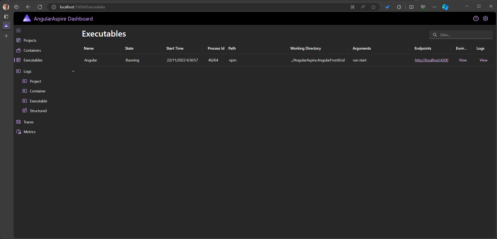

# Angular within .NET Aspire

> Used for blog post https://timdeschryver.dev/blog/how-to-include-an-angular-project-within-net-aspire

Run the AppHost project to see the demo in action.
This should start the Angular application and the Weather Forecast .NET API.

